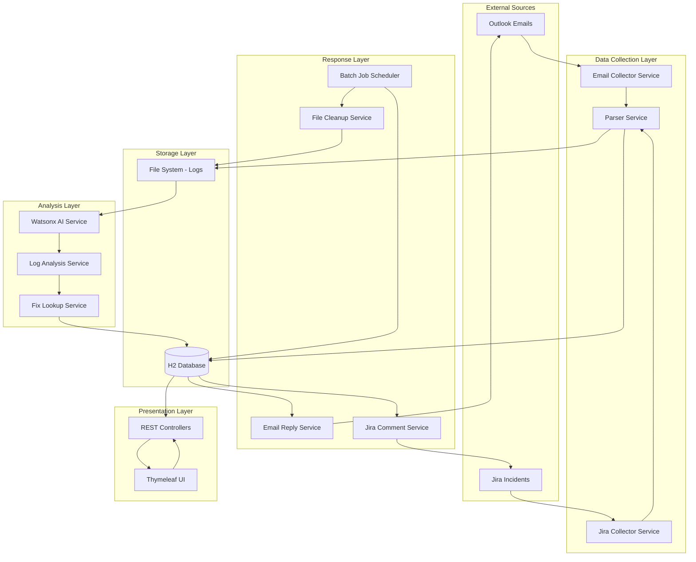
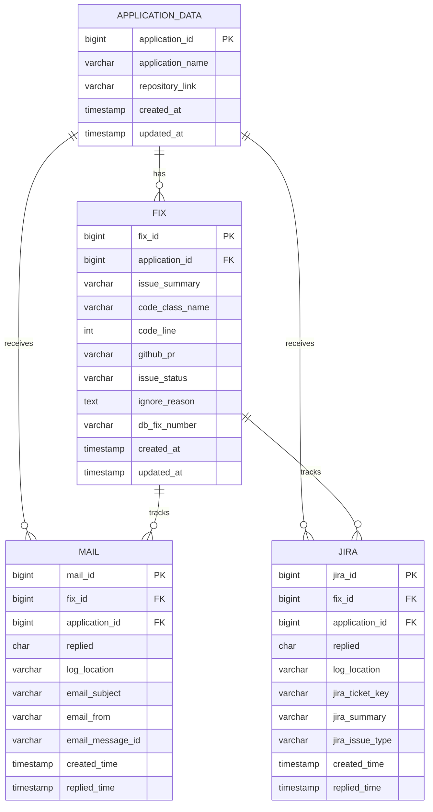
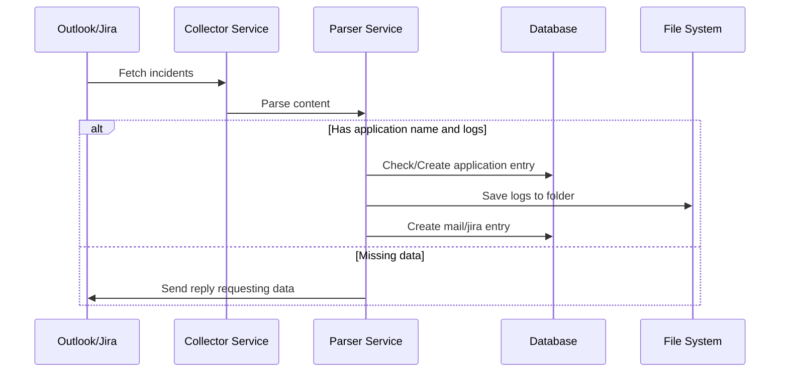
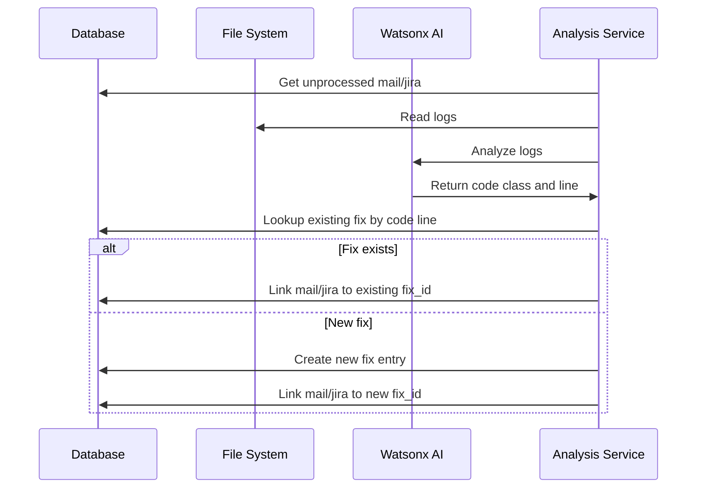
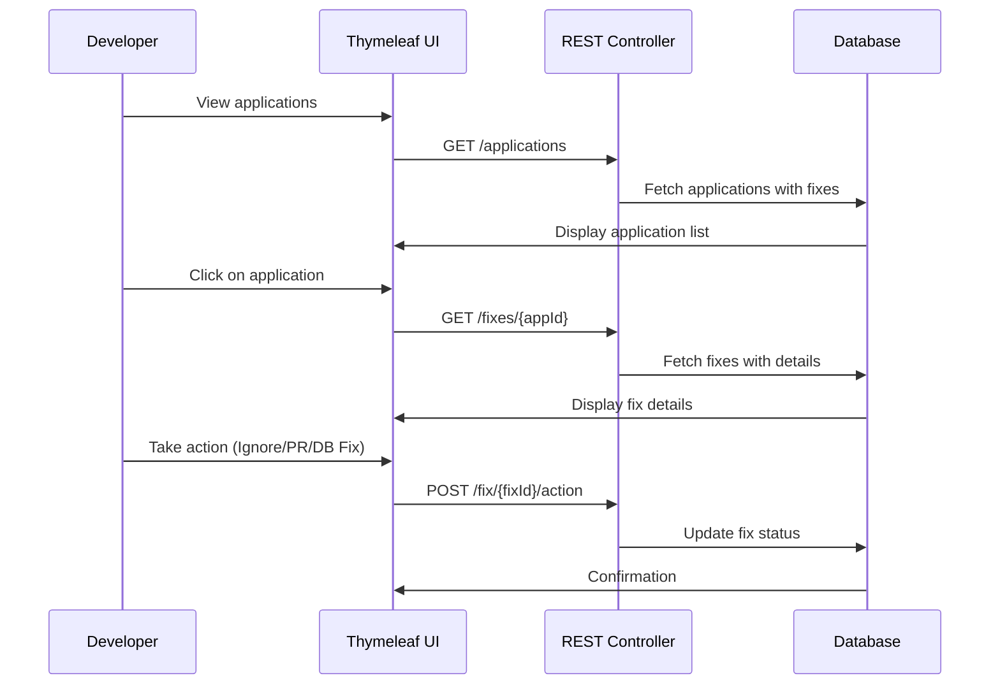
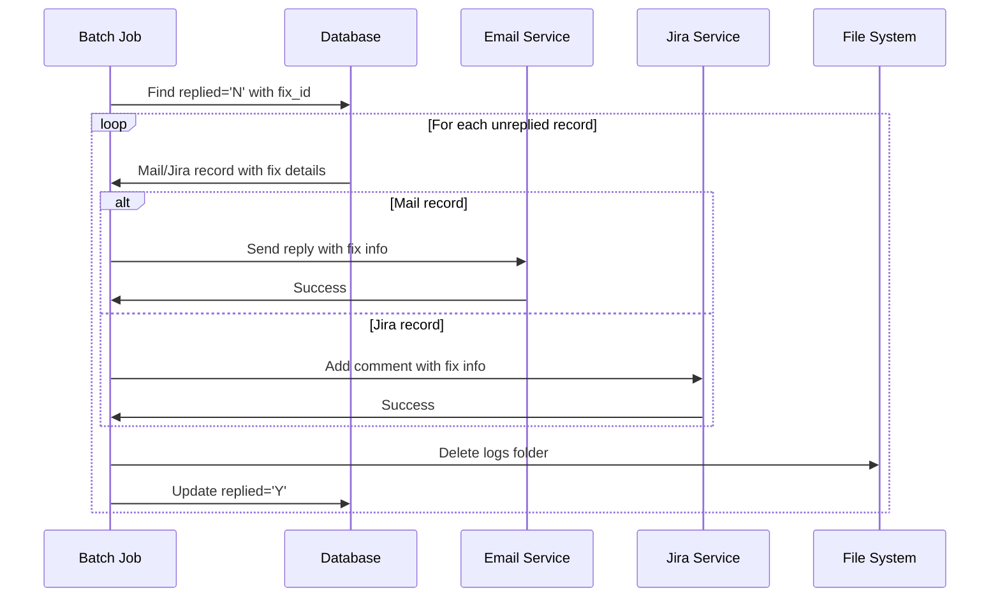

# Incident Management Automation System - Implementation Plan

## Project Overview

An automated incident management system that helps developers track and resolve code issues from multiple sources (Outlook emails and Jira incidents). The system analyzes logs using Watsonx AI, identifies problematic code lines, and automates responses back to the incident sources.

## Technology Stack

### Backend
- **Framework**: Spring Boot 3.x
- **Language**: Java 17+
- **Database**: H2 (in-memory for MVP)
- **ORM**: Spring Data JPA
- **Build Tool**: Maven

### Frontend
- **Template Engine**: Thymeleaf
- **UI Framework**: Bootstrap 5
- **JavaScript**: Vanilla JS / jQuery

### Integrations
- **Email**: Microsoft Graph API / JavaMail API
- **Issue Tracking**: Jira REST API
- **AI Analysis**: Watsonx AI API
- **Scheduler**: Spring @Scheduled

## System Architecture



## Database Schema

### Table: application_data
```sql
CREATE TABLE application_data (
    application_id BIGINT PRIMARY KEY AUTO_INCREMENT,
    application_name VARCHAR(255) NOT NULL UNIQUE,
    repository_link VARCHAR(500),
    created_at TIMESTAMP DEFAULT CURRENT_TIMESTAMP,
    updated_at TIMESTAMP DEFAULT CURRENT_TIMESTAMP ON UPDATE CURRENT_TIMESTAMP
);
```

### Table: fix
```sql
CREATE TABLE fix (
    fix_id BIGINT PRIMARY KEY AUTO_INCREMENT,
    application_id BIGINT NOT NULL,
    issue_summary VARCHAR(250),
    code_class_name VARCHAR(255),
    code_line INTEGER,
    github_pr VARCHAR(255),
    issue_status VARCHAR(50) DEFAULT 'PENDING',
    ignore_reason TEXT,
    db_fix_number VARCHAR(100),
    created_at TIMESTAMP DEFAULT CURRENT_TIMESTAMP,
    updated_at TIMESTAMP DEFAULT CURRENT_TIMESTAMP ON UPDATE CURRENT_TIMESTAMP,
    FOREIGN KEY (application_id) REFERENCES application_data(application_id),
    INDEX idx_code_line (application_id, code_class_name, code_line)
);
```

### Table: mail
```sql
CREATE TABLE mail (
    mail_id BIGINT PRIMARY KEY AUTO_INCREMENT,
    fix_id BIGINT,
    application_id BIGINT,
    replied CHAR(1) DEFAULT 'N',
    log_location VARCHAR(500),
    email_subject VARCHAR(500),
    email_from VARCHAR(255),
    email_message_id VARCHAR(255) UNIQUE,
    created_time TIMESTAMP DEFAULT CURRENT_TIMESTAMP,
    replied_time TIMESTAMP,
    FOREIGN KEY (fix_id) REFERENCES fix(fix_id),
    FOREIGN KEY (application_id) REFERENCES application_data(application_id),
    INDEX idx_replied (replied, fix_id)
);
```

### Table: jira
```sql
CREATE TABLE jira (
    jira_id BIGINT PRIMARY KEY AUTO_INCREMENT,
    fix_id BIGINT,
    application_id BIGINT,
    replied CHAR(1) DEFAULT 'N',
    log_location VARCHAR(500),
    jira_ticket_key VARCHAR(50) UNIQUE,
    jira_summary VARCHAR(500),
    jira_issue_type VARCHAR(50),
    created_time TIMESTAMP DEFAULT CURRENT_TIMESTAMP,
    replied_time TIMESTAMP,
    FOREIGN KEY (fix_id) REFERENCES fix(fix_id),
    FOREIGN KEY (application_id) REFERENCES application_data(application_id),
    INDEX idx_replied (replied, fix_id)
);
```

## Entity Relationships



## Phase-wise Implementation Flow

### Phase 1: Data Collection



### Phase 2: Data Analysis



### Phase 3: User Interaction



### Phase 4: Batch Reply



## Project Structure

```
incident-management-system/
├── src/
│   ├── main/
│   │   ├── java/
│   │   │   └── com/
│   │   │       └── incident/
│   │   │           └── management/
│   │   │               ├── IncidentManagementApplication.java
│   │   │               ├── config/
│   │   │               │   ├── AppConfig.java
│   │   │               │   ├── SecurityConfig.java
│   │   │               │   └── SchedulerConfig.java
│   │   │               ├── entity/
│   │   │               │   ├── Application.java
│   │   │               │   ├── Fix.java
│   │   │               │   ├── Mail.java
│   │   │               │   └── Jira.java
│   │   │               ├── repository/
│   │   │               │   ├── ApplicationRepository.java
│   │   │               │   ├── FixRepository.java
│   │   │               │   ├── MailRepository.java
│   │   │               │   └── JiraRepository.java
│   │   │               ├── service/
│   │   │               │   ├── collector/
│   │   │               │   │   ├── OutlookCollectorService.java
│   │   │               │   │   └── JiraCollectorService.java
│   │   │               │   ├── parser/
│   │   │               │   │   └── IncidentParserService.java
│   │   │               │   ├── analysis/
│   │   │               │   │   ├── WatsonxAIService.java
│   │   │               │   │   ├── LogAnalysisService.java
│   │   │               │   │   └── FixLookupService.java
│   │   │               │   ├── storage/
│   │   │               │   │   └── FileSystemService.java
│   │   │               │   ├── response/
│   │   │               │   │   ├── EmailReplyService.java
│   │   │               │   │   ├── JiraCommentService.java
│   │   │               │   │   └── FileCleanupService.java
│   │   │               │   └── batch/
│   │   │               │       └── BatchReplyService.java
│   │   │               ├── controller/
│   │   │               │   ├── ApplicationController.java
│   │   │               │   ├── FixController.java
│   │   │               │   └── DashboardController.java
│   │   │               ├── dto/
│   │   │               │   ├── ApplicationDTO.java
│   │   │               │   ├── FixDTO.java
│   │   │               │   └── ActionRequestDTO.java
│   │   │               └── exception/
│   │   │                   ├── GlobalExceptionHandler.java
│   │   │                   └── CustomExceptions.java
│   │   └── resources/
│   │       ├── application.properties
│   │       ├── application-dev.properties
│   │       ├── templates/
│   │       │   ├── layout.html
│   │       │   ├── dashboard.html
│   │       │   ├── applications.html
│   │       │   └── fix-details.html
│   │       └── static/
│   │           ├── css/
│   │           │   └── style.css
│   │           └── js/
│   │               └── app.js
│   └── test/
│       └── java/
│           └── com/
│               └── incident/
│                   └── management/
│                       ├── service/
│                       └── controller/
├── pom.xml
└── README.md
```

## Key Configuration Properties

```properties
# Application
spring.application.name=incident-management-system
server.port=8080

# H2 Database
spring.datasource.url=jdbc:h2:mem:incidentdb
spring.datasource.driverClassName=org.h2.Driver
spring.datasource.username=sa
spring.datasource.password=
spring.jpa.database-platform=org.hibernate.dialect.H2Dialect
spring.h2.console.enabled=true

# File Storage
app.storage.base-path=C:/Users

# Outlook Configuration
outlook.client-id=${OUTLOOK_CLIENT_ID}
outlook.client-secret=${OUTLOOK_CLIENT_SECRET}
outlook.tenant-id=${OUTLOOK_TENANT_ID}

# Jira Configuration
jira.base-url=${JIRA_BASE_URL}
jira.username=${JIRA_USERNAME}
jira.api-token=${JIRA_API_TOKEN}

# Watsonx AI Configuration
watsonx.api-key=${WATSONX_API_KEY}
watsonx.project-id=${WATSONX_PROJECT_ID}
watsonx.endpoint=${WATSONX_ENDPOINT}

# Batch Job Configuration
batch.reply.cron=0 0 */2 * * ?
```

## API Endpoints

### Application Management
- `GET /api/applications` - List all applications
- `POST /api/applications` - Create new application
- `GET /api/applications/{id}` - Get application details
- `PUT /api/applications/{id}` - Update application

### Fix Management
- `GET /api/fixes` - List all fixes
- `GET /api/fixes/{id}` - Get fix details
- `GET /api/applications/{appId}/fixes` - Get fixes for application
- `POST /api/fixes/{id}/ignore` - Mark fix as ignored
- `POST /api/fixes/{id}/in-progress` - Mark fix as in progress
- `POST /api/fixes/{id}/db-fix` - Mark as database fix

### Dashboard
- `GET /dashboard` - Main dashboard view
- `GET /applications` - Applications list view
- `GET /applications/{id}/fixes` - Fix details view

## Implementation Phases

### Phase 1: Foundation (Week 1-2)
- Set up Spring Boot project structure
- Configure H2 database and JPA
- Create entity models and repositories
- Implement basic CRUD operations
- Set up Thymeleaf templates

### Phase 2: Data Collection (Week 3-4)
- Implement Outlook integration
- Implement Jira integration
- Build parser service
- Create file system service
- Implement automated reply for missing data

### Phase 3: Analysis (Week 5-6)
- Integrate Watsonx AI API
- Build log analysis service
- Implement fix lookup logic
- Create fix management service
- Test end-to-end analysis flow

### Phase 4: UI & Interaction (Week 7-8)
- Design and implement Thymeleaf UI
- Create REST controllers
- Implement action handlers
- Add validation and error handling
- User acceptance testing

### Phase 5: Automation (Week 9-10)
- Implement batch job scheduler
- Build email reply service
- Build Jira comment service
- Implement file cleanup
- End-to-end testing

### Phase 6: Polish & Deploy (Week 11-12)
- Add logging and monitoring
- Create documentation
- Performance optimization
- Security hardening
- Deployment preparation

## Testing Strategy

### Unit Tests
- Service layer methods
- Repository operations
- Parser logic
- Fix lookup algorithm

### Integration Tests
- API endpoint testing
- Database operations
- External API integrations
- File system operations

### End-to-End Tests
- Complete workflow from email/Jira to reply
- UI interaction flows
- Batch job execution

## Security Considerations

1. **Credential Management**: Store API keys and credentials in environment variables
2. **Input Validation**: Validate all user inputs and external data
3. **SQL Injection Prevention**: Use parameterized queries via JPA
4. **XSS Prevention**: Thymeleaf auto-escapes by default
5. **File System Security**: Validate file paths to prevent directory traversal
6. **API Authentication**: Implement OAuth2 for production

## Monitoring & Logging

1. **Application Logs**: Use SLF4J with Logback
2. **Audit Trail**: Log all user actions and system operations
3. **Error Tracking**: Implement global exception handler
4. **Performance Metrics**: Monitor API response times
5. **Batch Job Monitoring**: Track success/failure rates

## Future Enhancements

1. **Multi-tenancy**: Support multiple users/teams
2. **OAuth Integration**: Replace manual credentials with OAuth
3. **Real-time Notifications**: WebSocket for live updates
4. **Advanced Analytics**: Dashboard with charts and metrics
5. **Machine Learning**: Improve fix suggestions over time
6. **Mobile App**: React Native mobile interface
7. **Slack Integration**: Notifications via Slack
8. **GitHub Integration**: Auto-create PRs from fixes

## Success Metrics

1. **Incident Processing Time**: < 5 minutes per incident
2. **Fix Accuracy**: > 80% correct code line identification
3. **Response Automation**: > 90% automated replies
4. **User Satisfaction**: Positive feedback from developers
5. **System Uptime**: > 99% availability

---

**Document Version**: 1.0  
**Last Updated**: 2026-05-03  
**Status**: Ready for Implementation