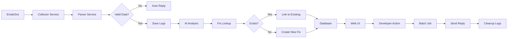

# Incident Management Automation System

An intelligent automation system that helps developers efficiently track and resolve code issues from multiple sources (Outlook emails and Jira incidents). The system uses AI-powered log analysis to identify problematic code locations and automates responses back to incident sources.

## 🎯 Overview

This system automates the entire incident management workflow:
1. **Collects** incidents from Outlook emails and Jira tickets
2. **Analyzes** logs using Watsonx AI to identify exact code locations
3. **Tracks** fixes with deduplication for recurring issues
4. **Provides** a web UI for developers to manage and update fix status
5. **Automates** responses back to incident sources with fix details

## 🏗️ Architecture

- **Backend**: Java 17, Spring Boot 3.x
- **Frontend**: Thymeleaf with Bootstrap 5
- **Database**: H2 (in-memory for MVP, upgradeable to PostgreSQL/MySQL)
- **Integrations**: Microsoft Graph API, Jira REST API, Watsonx AI
- **Storage**: Database for metadata, File system for logs

## 📋 Key Features

### Phase 1: Data Collection
- ✅ Fetch emails from Outlook with incident-related subjects
- ✅ Fetch incidents from Jira
- ✅ Parse and extract application name and logs
- ✅ Auto-reply when application name or logs are missing

### Phase 2: Data Analysis
- ✅ Store logs in organized file system structure
- ✅ Analyze logs using Watsonx AI
- ✅ Identify exact code class and line number
- ✅ Deduplicate fixes by code location
- ✅ Link multiple incidents to same fix

### Phase 3: User Interaction
- ✅ Web UI to view applications and their issues
- ✅ Display fix details with code location
- ✅ Action buttons: Ignore, In Progress, DB Fix
- ✅ Track PR numbers and fix numbers

### Phase 4: Automated Response
- ✅ Batch job to process unreplied incidents
- ✅ Send email replies with fix details
- ✅ Add Jira comments with fix information
- ✅ Clean up log files after successful reply

## 📁 Project Structure

```
incident-management-system/
├── IMPLEMENTATION_PLAN.md      # Detailed implementation plan with diagrams
├── TECHNICAL_SPECIFICATION.md  # Complete code specifications
├── SETUP_GUIDE.md             # Step-by-step setup instructions
├── README.md                  # This file
└── src/
    ├── main/
    │   ├── java/com/incident/management/
    │   │   ├── entity/          # JPA entities
    │   │   ├── repository/      # Data access layer
    │   │   ├── service/         # Business logic
    │   │   ├── controller/      # REST & web controllers
    │   │   └── config/          # Configuration classes
    │   └── resources/
    │       ├── application.properties
    │       ├── templates/       # Thymeleaf templates
    │       └── static/          # CSS, JS, images
    └── test/                    # Unit and integration tests
```

## 🚀 Quick Start

### Prerequisites
- Java 17+
- Maven 3.8+
- Microsoft Azure AD account (for Outlook)
- Atlassian Jira account
- IBM Watsonx AI account

### Installation

1. **Clone the repository**
   ```bash
   git clone <repository-url>
   cd incident-management-system
   ```

2. **Configure environment variables**
   ```bash
   # Create .env file with your credentials
   OUTLOOK_CLIENT_ID=your-client-id
   OUTLOOK_CLIENT_SECRET=your-client-secret
   OUTLOOK_TENANT_ID=your-tenant-id
   JIRA_BASE_URL=https://your-domain.atlassian.net
   JIRA_USERNAME=your-email@example.com
   JIRA_API_TOKEN=your-api-token
   WATSONX_API_KEY=your-api-key
   WATSONX_PROJECT_ID=your-project-id
   WATSONX_ENDPOINT=https://us-south.ml.cloud.ibm.com
   ```

3. **Build and run**
   ```bash
   mvn clean install
   mvn spring-boot:run
   ```

4. **Access the application**
   - Web UI: http://localhost:8080
   - H2 Console: http://localhost:8080/h2-console

For detailed setup instructions, see [`SETUP_GUIDE.md`](SETUP_GUIDE.md).

## 📊 Database Schema

### Core Tables
- **application_data**: Stores application information and repository links
- **fix**: Tracks code issues with class name, line number, and status
- **mail**: Links email incidents to fixes
- **jira**: Links Jira incidents to fixes

### Relationships
- Application → Fix (One-to-Many)
- Application → Mail (One-to-Many)
- Application → Jira (One-to-Many)
- Fix → Mail (One-to-Many)
- Fix → Jira (One-to-Many)

See [`IMPLEMENTATION_PLAN.md`](IMPLEMENTATION_PLAN.md) for detailed schema and ER diagrams.

## 🔧 Configuration

Key configuration properties in `application.properties`:

```properties
# Server
server.port=8080

# Database
spring.datasource.url=jdbc:h2:mem:incidentdb

# File Storage
app.storage.base-path=C:/Users

# Batch Job (runs every 2 hours)
batch.reply.cron=0 0 */2 * * ?
```

## 🎨 User Interface

### Applications View
Lists all applications with their open issues count and quick access to fix details.

### Fix Details View
Shows detailed information for each fix:
- Code location (class name and line number)
- Issue summary
- Current status
- Action buttons (Ignore, In Progress, DB Fix)

## 🔄 Workflow



## 📚 Documentation

- **[IMPLEMENTATION_PLAN.md](IMPLEMENTATION_PLAN.md)**: Complete implementation plan with architecture diagrams, database schema, and phase-wise breakdown
- **[TECHNICAL_SPECIFICATION.md](TECHNICAL_SPECIFICATION.md)**: Detailed code specifications with complete implementations for all services
- **[SETUP_GUIDE.md](SETUP_GUIDE.md)**: Step-by-step setup and deployment guide with troubleshooting

## 🧪 Testing

Run tests with:
```bash
# Unit tests
mvn test

# Integration tests
mvn verify

# All tests with coverage
mvn clean verify
```

## 📈 Monitoring

### Application Logs
Monitor application behavior through structured logging:
```
INFO  - Fetching emails from Outlook
INFO  - Processing incident for application: MyApp
INFO  - Created new fix with ID: 123
INFO  - Batch reply process completed
```

### Database Queries
Monitor system health:
```sql
-- Check unreplied incidents
SELECT COUNT(*) FROM mail WHERE replied = 'N';
SELECT COUNT(*) FROM jira WHERE replied = 'N';

-- Fix status distribution
SELECT issue_status, COUNT(*) FROM fix GROUP BY issue_status;
```

## 🔐 Security

- Environment variables for sensitive credentials
- Input validation on all user inputs
- Parameterized queries via JPA
- XSS prevention through Thymeleaf auto-escaping
- File path validation to prevent directory traversal

## 🚢 Deployment

### Development
```bash
mvn spring-boot:run
```

### Production
```bash
# Build JAR
mvn clean package -DskipTests

# Run JAR
java -jar target/incident-management-system-0.0.1-SNAPSHOT.jar
```

For Windows service deployment, see [`SETUP_GUIDE.md`](SETUP_GUIDE.md#104-run-as-windows-service).

## 🛠️ Technology Stack

| Component | Technology |
|-----------|-----------|
| Backend Framework | Spring Boot 3.x |
| Language | Java 17 |
| Frontend | Thymeleaf + Bootstrap 5 |
| Database | H2 (upgradeable to PostgreSQL/MySQL) |
| ORM | Spring Data JPA |
| Email Integration | Microsoft Graph API |
| Issue Tracking | Jira REST API |
| AI Analysis | IBM Watsonx AI |
| Build Tool | Maven |
| Testing | JUnit 5, Spring Test |

## 📝 API Endpoints

### REST API
- `GET /api/applications` - List all applications
- `GET /api/applications/{id}/fixes` - Get fixes for application
- `POST /api/fixes/{id}/ignore` - Mark fix as ignored
- `POST /api/fixes/{id}/in-progress` - Mark fix as in progress
- `POST /api/fixes/{id}/db-fix` - Mark as database fix

### Web UI
- `GET /dashboard` - Main dashboard
- `GET /applications` - Applications list
- `GET /applications/{id}/fixes` - Fix details

## 🤝 Contributing

1. Follow the implementation plan in [`IMPLEMENTATION_PLAN.md`](IMPLEMENTATION_PLAN.md)
2. Refer to code specifications in [`TECHNICAL_SPECIFICATION.md`](TECHNICAL_SPECIFICATION.md)
3. Write tests for new features
4. Update documentation as needed

## 📋 Todo List

See the detailed todo list in the planning phase:
- [x] Project structure and architecture design
- [x] Database schema design
- [x] Service layer specifications
- [ ] Implementation (ready to start)
- [ ] Testing
- [ ] Deployment

## 🔮 Future Enhancements

- Multi-tenancy support
- OAuth2 authentication
- Real-time WebSocket notifications
- Advanced analytics dashboard
- Machine learning for fix suggestions
- Mobile app (React Native)
- Slack integration
- GitHub auto-PR creation

## 📞 Support

For issues or questions:
1. Check [`SETUP_GUIDE.md`](SETUP_GUIDE.md) troubleshooting section
2. Review application logs
3. Consult [`TECHNICAL_SPECIFICATION.md`](TECHNICAL_SPECIFICATION.md)
4. Contact the development team

## 📄 License

[Add your license here]

## 👥 Authors

[Add author information here]

---

**Version**: 1.0.0  
**Status**: Planning Complete - Ready for Implementation  
**Last Updated**: 2026-05-03